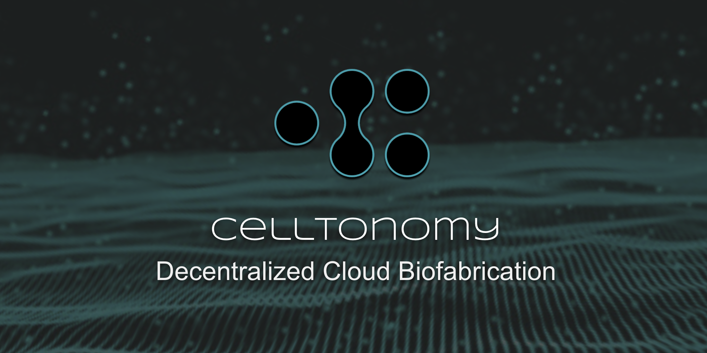

```
Document: Celltonomy Whitepaper
Version: 1.0
Document Source: https://github.com/celltonomy/white_paper
Project Code: https://github.com/celltonomy
```

# Abstract

Celltonomy is a public decentralized network designed to make the following capabilities widely available and accessible:

1. Grow biological systems
2. Perform bioscience R&D
3. Move bio-systems and derived biologics to prefered destinations
4. Transact bio-systems, derived biologics, and materials required for production

Celltonomy is a combination of a cloud-biolab (however, decentralized) and an open source package repository. Packages in Celltonomy are protocols for fabricating and processing biological systems.

Celltonomy is designed to be owned and operated by a global community of Celltonomy users and supporters.

# Core Elements

## Networks

1. Validator Network
2. Fulfillment Network
3. Governance Network

## Reputation

A variety of metrics may be considered when computing Reputation. This is likely to be an area of significant iteration.

### For Buyers

* Number of purchases
* Purchase value
*  

### For Fulfillment Providers


## Event Log

# What gets written to chain?

# Reputation Metric

## How is it calculated?

# Networks

## Validator Network

## Fabrication Network

## Governance Network

# Primary Network Systems

Purchase Order System

§1.2 Dispute Settlement SystemClaim"I received the wrong item”QuestionsIs the shipping label correct?How do I verify this?Is it addressed to me?
Was the fabrication protocol executed to spec?How can we know?Event Log: Have every bot / bot pool record which instructions they’re executingPotential CausesThe “I did not receive the item”QuestionsWas it delivered?Was it stolen?Potential Causes
“The protocol wasn’t executed to spec”QuestionsPotential Causes
“The order is taking too long / longer than spec’ed”Questions• Is this due to delay with fabrication, shipping carrier, customs, or some other factor?Potential Causes
ScenariosThe Protocol Was Executed To Spec
The Protocol Was Not Executed To SpecClaimed by end-userHow is this validated?What if every step of every protocol was written to (side) chain?
Research QuestionsWhat about items which have lifetime specs? E.g. you receive receipt up front, but the thing is supposed to last for x period of time, and then doesn't / lasts for x-y period of time.
Resolution OutcomesRefundRedo the orderRedo the order with different fulfillment provider(s)‘Store credit’


§1.3 Performance Audit System§1.4 Entity Registration System§1.5 Upgrade System


§1.6 GovernanceHow Compound does it: https://medium.com/compound-finance/compound-governance-5531f524cf68
§1.7 Treasury

# Tokenomics

## How do you get coin?

## What do you spend coin on?

## When are new coins minted?

## Under what circumstances are coins burned?

# Red Team Exploits

In this section we attempt to enumerate the variety of ways bad actors might attempt to exploit the network as well as identify and address common exploit concerns raised by people new to Celltonomy.
