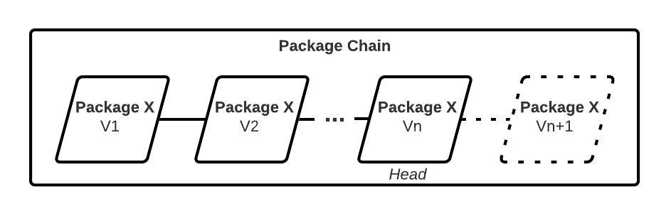
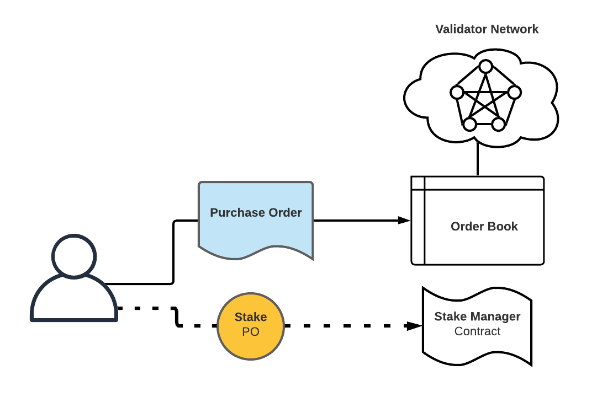
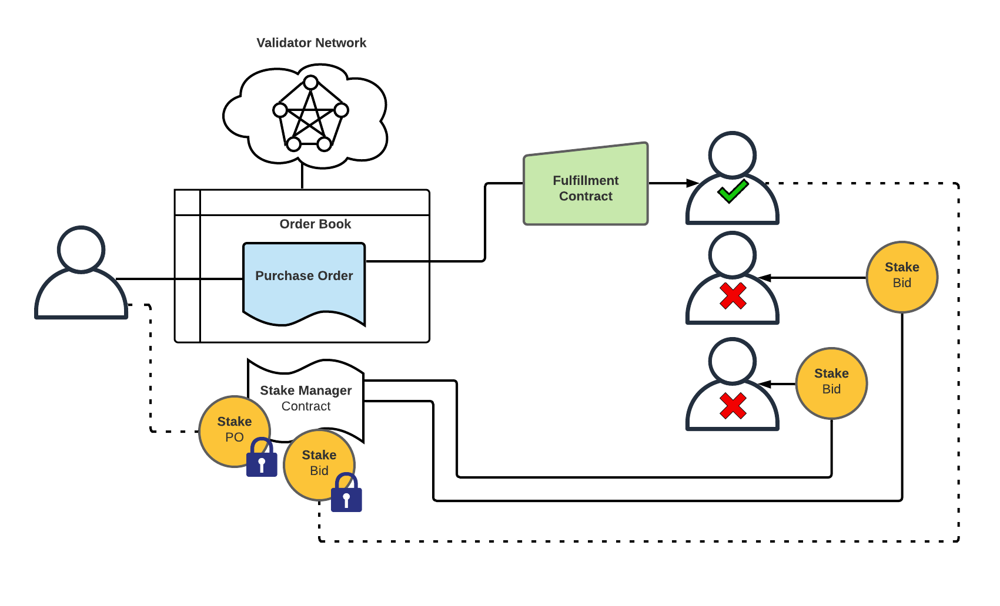
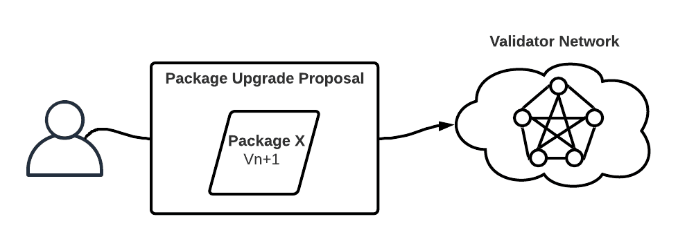
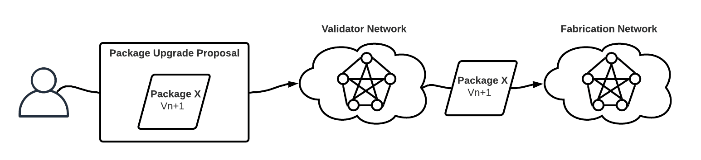
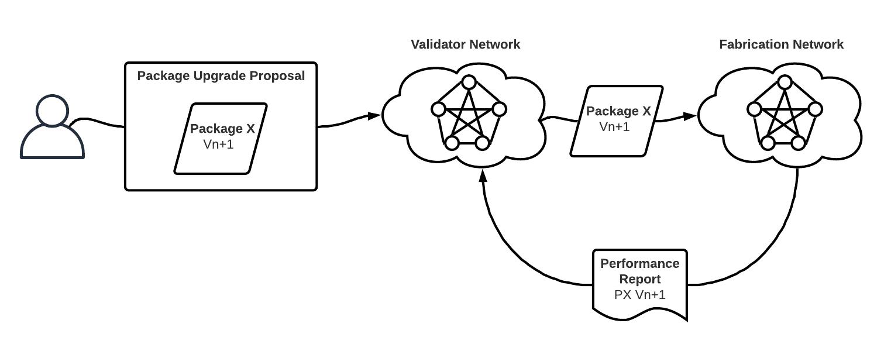
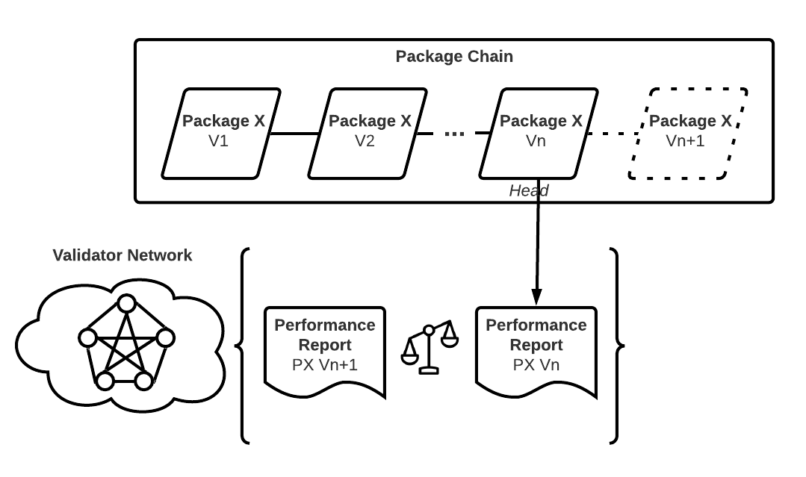
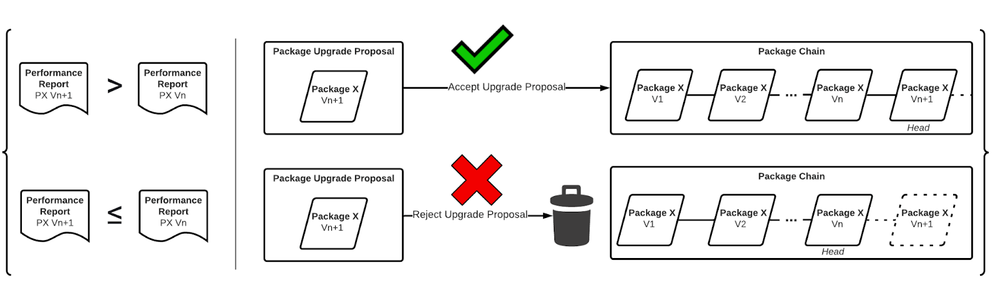

```
Document: Celltonomy Whitepaper
Version: 1.0
Document Source: https://github.com/celltonomy/white_paper
Project Code: https://github.com/celltonomy
Website: https://celltonomy.com
```

**Table of Contents**

[Abstract](#abstract)

[Mining](#mining)

[Component Networks](#component-networks)

[Primary Network Systems](#primary-network-systems)

[Reputation](#reputation)

[Event Log](#event-log)

[What gets written to chain?](#what-gets-written-to-chain?)

[Tokenomics](#tokenomics)

[Red Team Exploits](#red-team-exploits)


# Overview

**What is Celltonomy?**

Celltonomy is infrastructure for growing biological systems.

# Abstract

Celltonomy is a public decentralized network designed to make the following capabilities widely available and accessible:

1. Grow biological systems
2. Perform bioscience R&D
3. Move bio-systems and derived biologics to prefered destinations
4. Transact bio-systems, derived biologics, and materials required for production

Celltonomy is a combination of a cloud-biolab (however, decentralized) and an open source package repository. Packages in Celltonomy are protocols for fabricating and processing biological systems.

By combining the cloud-biolab functionality with a (protocol) package repository, Celltonomy is designed to be a unified system able to produce any biological system.

Celltonomy is designed to be owned and operated by a global community of Celltonomy users and supporters.

# Package System

Packages are Protocols.




# Fabrication Network

# BotSpec

## Upgradable Fabrication Capability


# Mining

Run bots, earn network rewards as well as revenue from fullfilling orders.

# Component Networks

1. Validator Network
2. Fulfillment Network
3. Governance Network


# Glossary

`Account`

`Reputation Profile`

`Spec` :

`Catalog Item` : A specific 

`Implementation Protocol (IP)`: Specific process / machine instruction for fabricating a target good (or service?)

`Package` : Bundle of an IP + a Spec for that IP

`Service Offering` : Catalog Item + Spec


`Validator Network` :

`Purchase Order` :

`Purchase Order (PO) Stake`

`Fulfillment Bid`

`Fulfillment Bid (FB) Stake`:

`Fulfillment Contract`


# Joining The Network

## Vendor

Create a `Profile`.

Register `Service Offerings`.

Profile

## Buyer

Create a Profile

## Validator

Celltonomy is a Proof-of-Stake network. Validators may join the network by staking an appropriate amount of network token. The specific amount of network token required to be staked to be a validator 

## Govenor

Governance network

# 

## Purchase Order System

## No-Bid Direct Purchase

* Check Catalog


## Purchase Order Fulfillment Bidding

### 1. Purchase Order Is Submitted

The `Buyer` sends a `Purchase Order`to the `Order Book` maintained by the `Validator Network`, and a `Purchase Order Stake` to the `Stake Manager` contract.

### 

#### Questions

* How much does the `Purchase Order Stake` need to be? 

  * How do we determine this value requirement before `Fulfillment Bids` are submitted?

    * Could base it on historic pricing for  

      


### 2. Fulfillment Bids Are Taken

Each `Fulfillment Provider` that is submitting a `Fulfillment Bid` sends a `Bid Stake` to the `Stake Manager` contract.


### 3. Fulfillment Contract Is Awarded



### 4. Payment And Fees Are Paid

[ IMAGE ]

#### Research Questions

* Should we hold the payment in escrow, or offer this as an option?
* Can variably priced contracts (e.g. hourly, adjusted based on costs, ...) be awarded, or just fixed-priced purchases?


### 5. Work Is Performed


### 6. Finished Asset And Work Completion Confirmation Code Are Shipped To Buyer


### 7a. If Work Is Completed To Satisfaction, Buyer Closes Transaction

Purchase Order Stake is returned to buyer

Fulfillment Bid Stake is returned to fulfillment provider.


### 7b. If Work Is Not Completed To Satisfaction, Buyer Does NOT Close Transaction, And Begins The Dispute Settlement Process


# Dispute Settlement System

The Dispute Settlement System is likely to evolve significantly over time.

For TestNet development we can focus our current efforts on the following:

1. Defining the scope of [potential resolution outcomes](#potential-resolution-outcomes), 
2. Identifying expected [dispute scenarios](#dispute-scenarios) 
3. Identifying [research questions](#research-questions)

## Potential Resolutions Outcomes

1. Refund
2. Redo the order
3. Redo the order with different fulfillment provider(s)
4. ‘Store credit’
5. Litigation

## Dispute Scenarios

### <u>"I received the wrong item”</u>

#### Questions

1. Is the shipping label correct?

   * How do is this verified?

   * Is package addressed to appropriate recipient?

     

2. Was the fabrication protocol executed to spec?

   * How can we know?
   * Event Log: Have every bot / bot pool record which instructions they’re executing

#### Potential Causes


#### Resolution


### <u>“I did not receive the item”</u>

#### Questions

* Was it delivered?

* Was it stolen?

#### Potential Causes


#### Resolution


### <u>“The protocol was not executed to spec”</u>

#### Questions

* How is this validated?

#### Potential Causes


#### Resolution


### <u>“The order is taking too long / longer than spec’ed”</u>

#### Questions

* Is this due to delay with fabrication, shipping carrier, customs, or some other factor?

#### Potential Causes


#### Resolution


## Research Questions

1. What about items which have ‘lifetime' specs? 

   * E.g. You receive your item, but the thing is supposed to last for X period of time, and then doesn't / only lasts for X-Y period of time.

     

2. Should we support litigation, or should this be an off-chain issue?


# Performance Audit System


# Entity Registration System


# Upgrade System

### 1


### 2


### 3


### 4


### 5


### 6


# Governance

How Compound does it: https://medium.com/compound-finance/compound-governance-5531f524cf68


# Treasury

# Reputation

A variety of metrics may be considered when computing Reputation. This is likely to be an area of significant iteration.

## For Buyers

* Number of purchases
* Purchase value
* 

## For Fulfillment Providers


# Event Log


# What gets written to chain?


# Tokenomics

## How do you get coin?

## What do you spend coin on?

## When are new coins minted?

## Under what circumstances are coins burned?

# Red Team Exploits

In this section we attempt to enumerate the variety of ways bad actors might attempt to exploit the network as well as identify and address common exploit concerns raised by people new to Celltonomy.

## Fake Orders

## Fake Fulfillment

## Fake Shipping
