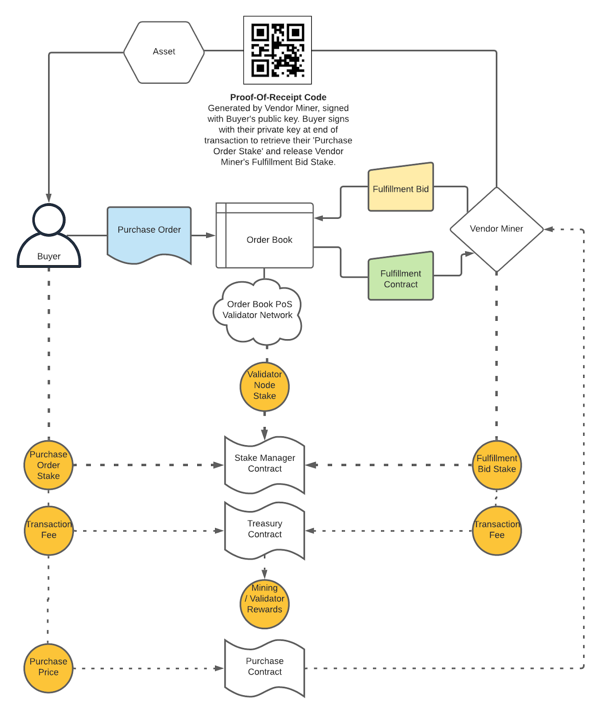

```
Document: Celltonomy Whitepaper
Version: 1.0
Document Source: https://github.com/celltonomy/white_paper
Project Code: https://github.com/celltonomy
```

**Table of Contents**

[Abstract](#abstract)

[Mining](#mining)

[Component Networks](#component-networks)

[Primary Network Systems](#primary-network-systems)

[Reputation](#reputation)

[Event Log](#event-log)

[What gets written to chain?](#what-gets-written-to-chain?)

[Tokenomics](#tokenomics)

[Red Team Exploits](#red-team-exploits)

# Abstract

Celltonomy is a public decentralized network designed to make the following capabilities widely available and accessible:

1. Grow biological systems
2. Perform bioscience R&D
3. Move bio-systems and derived biologics to prefered destinations
4. Transact bio-systems, derived biologics, and materials required for production

Celltonomy is a combination of a cloud-biolab (however, decentralized) and an open source package repository. Packages in Celltonomy are protocols for fabricating and processing biological systems.

By combining the cloud-biolab functionality with a (protocol) package repository, Celltonomy is designed to be a unified system able to produce any biological system.

Celltonomy is designed to be owned and operated by a global community of Celltonomy users and supporters.


# Mining

Run bots, earn network rewards as well as revenue from fullfilling orders.

# Component Networks

1. Validator Network
2. Fulfillment Network
3. Governance Network

# Reputation

A variety of metrics may be considered when computing Reputation. This is likely to be an area of significant iteration.

## For Buyers

* Number of purchases
* Purchase value
*  

## For Fulfillment Providers


# Event Log

# Primary Network Systems

## Purchase Order System




## Dispute Settlement System

The Dispute Settlement System is likely to evolve significantly over time.

For TestNet development we can focus our current efforts on defining the scope of [potential resolution outcomes](#potential-resolution-outcomes), and identifying expected [dispute scenarios](#dispute-scenarios) and [research questions](#research-questions) for particularly complex dispute scenarios.

### Potential Resolutions Outcomes

1. Refund
2. Redo the order
3. Redo the order with different fulfillment provider(s)
4. ‘Store credit’
5. Litigation

### Dispute Scenarios

#### <u>"I received the wrong item”</u>

##### Questions

1. Is the shipping label correct?

   * How do is this verified?

   * Is package addressed to appropriate recipient?

     

2. Was the fabrication protocol executed to spec?

   * How can we know?
   * Event Log: Have every bot / bot pool record which instructions they’re executing

##### Potential Causes


##### Resolution


#### <u>“I did not receive the item”</u>

##### Questions

* Was it delivered?

* Was it stolen?

##### Potential Causes


##### Resolution


#### <u>“The protocol was not executed to spec”</u>

##### Questions

* How is this validated?

##### Potential Causes


##### Resolution


#### <u>“The order is taking too long / longer than spec’ed”</u>

##### Questions

* Is this due to delay with fabrication, shipping carrier, customs, or some other factor?

##### Potential Causes


##### Resolution


### Research Questions

1. What about items which have ‘lifetime' specs? 

   * E.g. You receive your item, but the thing is supposed to last for X period of time, and then doesn't / only lasts for X-Y period of time.

     

2. Should we support litigation, or should this be an off-chain issue?


## Performance Audit System


## Entity Registration System


## Upgrade System


## Governance

How Compound does it: https://medium.com/compound-finance/compound-governance-5531f524cf68

## Treasury

# What gets written to chain?


# Tokenomics

## How do you get coin?

## What do you spend coin on?

## When are new coins minted?

## Under what circumstances are coins burned?

# Red Team Exploits

In this section we attempt to enumerate the variety of ways bad actors might attempt to exploit the network as well as identify and address common exploit concerns raised by people new to Celltonomy.
